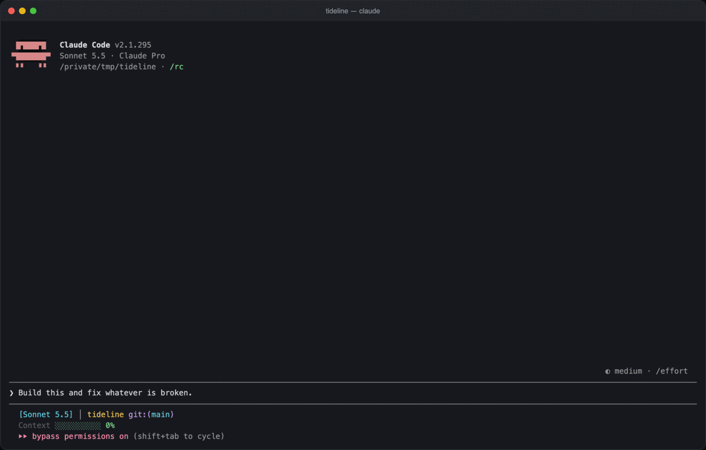
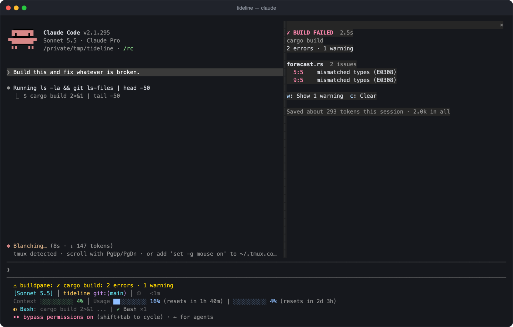

# buildpane

**Build, test and lint results in a pane, and far fewer tokens spent reading logs.**

buildpane is a Claude Code mod. When Claude runs a build, a test suite or a linter, buildpane reads the output, shows the errors grouped by file in a live pane, and hands Claude the diagnostics instead of the raw log. A 400-line `cargo build` becomes a dozen lines Claude can act on, and the pane keeps a running count of the tokens that saved.



It works by itself: there is nothing to run and no command to learn.

## Install

Needs Claude Code 2.1.295 or later.

```
/plugin marketplace add griches/buildpane
/plugin install buildpane@buildpane
```

Or from a shell:

```sh
claude plugin marketplace add griches/buildpane
claude plugin install buildpane@buildpane
```

Run `/reload-plugins` in a session that is already open.

## What it reads

| Toolchain | Commands | What is read |
| --- | --- | --- |
| TypeScript | `tsc`, `vue-tsc` | Errors with file, line, column and `TS` code, plain or `--pretty` |
| ESLint | `eslint` | Errors and warnings with their rule |
| Rust | `cargo build`, `check`, `clippy`, `test` | Errors and warnings with their `E` code; failed tests with the panic message and place |
| Go | `go build`, `vet`, `test` | Compile errors; failed tests with their message |
| Python | `pytest`, `mypy`, `pyright`, `ruff check` | Failed tests; type and lint errors with their code |
| JavaScript tests | `jest`, `vitest`, `bun test` | Counts and failed tests with message and place |
| JVM | `gradle`, `./gradlew`, `mvn`, `javac`, `kotlinc` | Kotlin and Java errors and warnings; failed tests |
| .NET | `dotnet build`, `dotnet test` | Errors with their `CS` code; failed tests |
| C and C++ | `make`, `ninja`, `cmake --build`, `gcc`, `clang` | Errors and warnings |
| Package scripts | `npm test`, `npm run build`, `pnpm lint`, `yarn typecheck` and the like | Whatever the script runs, from the list above |

Runners and wrappers are followed: `npx tsc`, `pnpm exec vitest`, `uv run pytest`, `python -m pytest`, `cd app && cargo test 2>&1 | tail -40`.

`xcodebuild` and `swift build` are left to [xcpane](https://github.com/griches/xcpane), which reads Xcode's result bundle and says more than the log does. The two run side by side.

## What you see

- **A pane** with the verdict, the errors grouped by file, the failed tests, and the earlier runs. `w` shows the warnings, `c` clears. It opens when a run fails.
- **A compact row** in the transcript where the raw log would be: the verdict and the first errors.
- **A status line** while a run is failing, and a toast when one passes.
- **A savings line** in the pane: tokens saved this session and in all.



`/buildpane` opens the pane. `/buildpane clear` forgets the runs.

## What Claude reads

```
cargo build: BUILD FAILED in 2.7s (exit code 101)
1 error · 1 warning

src/lib.rs:7:5: error E0308: mismatched types

1 warning not listed: lib.rs (1). Call mcp__buildpane__details to list them.

Other lines that mention a failure:
  error: could not compile `demo` (lib) due to 1 previous error; 1 warning emitted

[buildpane: summarised from 44 lines of output. Call mcp__buildpane__details with show "raw" for the output itself.]
```

Nothing is hidden for good. Claude can call the `details` tool for every warning, the failed tests, or the end of the raw output, and the transcript on your side always keeps the output as it was.

buildpane only replaces output it understood:

- A failure it could read no error or failed test out of reaches Claude untouched.
- A summary has to be at least 30% shorter than the output, or the output stays.
- Lines that mention a failure without being one of the errors read (a linker error, a crash) are kept in the summary.
- Commands run in the background are left alone.
- A line that also prints something else, such as `cat src/a.ts && tsc`, keeps its whole output. The pane still shows the build.
- Five warnings or fewer are listed in the summary; more are counted per file.

## Settings

All under buildpane in `/config`.

| Setting | Default | What it does |
| --- | --- | --- |
| Condense what Claude reads | on | Off: Claude reads the raw output and the pane still shows the run |
| Warnings Claude reads | count | `list`: every warning goes into the summary |
| Open the pane | failure | `always`: when a run starts. `never`: only on `/buildpane` |
| Compact transcript row | on | Off: the transcript shows the raw output |

## How the savings are counted

Characters of output replaced, less the characters of the summary, divided by four. It is an estimate of tokens, not a bill.

## What it does on your machine

buildpane is a mod: code that runs inside Claude Code. This is everything it does.

**It watches Bash commands.** It hooks the Bash tool, and when a command is a build, a test run or a lint run it lets the command run unchanged and then reads its output. It never changes a command and runs no command of its own. Other commands are passed on untouched.

**It replaces what Claude reads of that output.** It hooks the row Claude Code stores for the tool's result and, for a run it understood, swaps the raw output for the summary shown above. Your transcript keeps the raw output, and the `details` tool hands any of it back.

**It reads one kind of file**: when Claude Code has saved a long output to a file of its own, buildpane reads that file to see the whole output.

**It makes no network requests and calls no model.**

**It keeps one number between sessions**: the running total of characters saved, in Claude Code's own plugin storage.

**It adds** the `/buildpane` command, a pane, a status line, a toast, a compact transcript row, and one tool for the model, `details`, which lists stored results and runs nothing.

## Development

```sh
claude plugin validate .
claude plugin test .
claude --plugin-dir .
```

The fixtures in `tests/fixtures.ts` are real output from each tool where it was installed, and say so where they are not.

## Licence

MIT. See [LICENSE](LICENSE).
